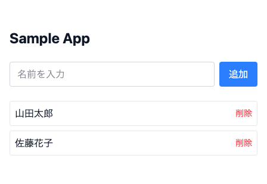

# intern-web-app-assignment-template-2026-summer

2026年夏 長期インターン選考プログラムの課題（デモシステム開発）用テンプレート。FastAPI（Python）+ Next.jsを環境構築しただけの状態に、動作確認用のサンプルCRUD（`Sample`: `id`・`name`のみ）を1つ置いてある。

課題の実装（機能追加）はこのサンプルを参考にしながら、`backend/app/main.py`・`frontend/app/src/app/page.tsx`に書き足していく想定。認証・認可機能・lint・テスト・CIは実装していない。

> **前提**: このページを見ているということは、配布された「テンプレートを自分のGitHubリポジトリにする手順」PDFの手順（ZIP展開→GitHubへのpush）は完了済みのはず。まだの場合は先にそちらを行うこと。

## 構成

| ディレクトリ | 内容 |
|---|---|
| [`backend/`](./backend/README.md) | FastAPI（Python）ベースのバックエンド |
| [`frontend/`](./frontend/README.md) | Next.js（App Router）ベースのフロントエンド |
| [`docs/`](./docs) | 選考プログラム案内・課題内容・環境構築ガイドなどの配布資料（PDF） |

`docs/`の内訳:

| ファイル | 内容 |
|---|---|
| [`selection-program-guide.pdf`](./docs/selection-program-guide.pdf) | 長期インターン選考プログラムの案内 |
| [`assignment-brief.pdf`](./docs/assignment-brief.pdf) | 課題内容（デモシステム開発提案） |
| [`repository-setup-guide.pdf`](./docs/repository-setup-guide.pdf) | このテンプレートを自分のGitHubリポジトリにする手順 |

[`draft/`](./docs/draft)には各PDFのHTML原稿を置いている。配布物ではなく、内容を修正するときの編集用ドラフト。

- UI: Tailwind CSSのみ（コンポーネントライブラリは使わない）
- 通信: フロントエンドは素の`fetch`でバックエンドAPIを呼ぶ（ライブラリなし）

## 必要なツール（インストールと確認）

以下を順にインストールする。それぞれ「これができればOK」というゴールも書いておく。

### 1. VS Code（または Cursor）

- [VS Codeをダウンロード](https://code.visualstudio.com/download)してインストールする（[Cursor](https://cursor.com/downloads)でも可）
- 起動したら、左端のアイコン一覧から拡張機能（四角が4つ並んだアイコン）を開き、**「Dev Containers」**（発行元: Microsoft）を検索してインストールする（[拡張機能ページ](https://marketplace.visualstudio.com/items?itemName=ms-vscode-remote.remote-containers)）
- **ゴール**: VS Codeの拡張機能一覧に「Dev Containers」が入っている状態
- Python用（Pylance等）・フロントエンド用（Tailwind CSS IntelliSense等）の拡張機能は、後述の「Reopen in Container」でコンテナ内に自動インストールされる。自分で個別に入れる必要はない

### 2. Docker Desktop

- [Docker Desktopをダウンロード](https://www.docker.com/products/docker-desktop/)してインストールする
- インストール後に**起動しておく**（このアプリはバックグラウンドで常駐させておく必要がある。Macなら画面上部のメニューバー、Windowsならタスクバーの通知領域にクジラのアイコンが出ていれば起動中）
- **ゴール**: ターミナルで`docker --version`を実行してバージョンが表示される。かつDocker Desktopのアプリが起動している（アイコンがグレーアウトしていない）

AIツール（Claude Code等）の利用は自由。ただし生成されたコードの内容を自分で理解した状態で提出すること。

このリポジトリは既に自分のGitHubアカウント上にある前提（ZIPからのセットアップ手順は別途配布した資料を参照）。

## 環境構築手順

1. 自分のリポジトリをまだ手元に持っていない場合はclone: `git clone <自分のリポジトリのURL>`
2. VS Code（または Cursor）でそのフォルダを開く（メニューの「ファイル」→「フォルダーを開く」）
3. Docker Desktopが起動していることを確認してから、画面左下の `><` アイコンをクリックし、**「Reopen in Container」**を選ぶ
   - `backend`と`frontend`それぞれにDevContainerの設定があるので、まず片方（例: `frontend`）を選んで開く。もう片方も並行して触りたい場合は、別のVS Codeウィンドウでもう一度同じ手順を行うか、次のコマンドで両方まとめて起動する
4. コンテナをコマンドでまとめて起動したい場合は、VS Codeのターミナル（またはGit Bash/ターミナル.app）でリポジトリ直下から以下を実行する

   ```bash
   docker compose -f docker-compose.backend.yml -f docker-compose.frontend.yml up
   ```

`environments/.env.local`はローカル専用のダミー値のみを含むためリポジトリに含まれており、追加設定なしで起動できる。

### 動作確認

初回はイメージのビルドに数分かかる。起動できたら、ブラウザで以下を開いて確認する。

| 確認先 | 見えるべきもの |
|---|---|
| http://localhost:3000 | サンプルの一覧・名前を追加するフォームが表示される |
| http://localhost:8000 | `{"status":"healthy"}` という文字が表示される |
| http://localhost:8000/docs | Swagger UI（APIの仕様一覧）が表示される |

http://localhost:3000 はこのような画面になる（名前を追加・削除できるだけのシンプルなサンプル）:



うまく表示されない場合は、まずDocker Desktopが起動しているか、上記コマンドやVS Codeの「Dev Containers」ログにエラーが出ていないかを確認する。

起動後のサービス一覧:

| サービス | URL | 補足 |
|---|---|---|
| フロントエンド（Next.js） | http://localhost:3000 | |
| バックエンド（FastAPI） | http://localhost:8000 | |
| Swagger UI（API仕様） | http://localhost:8000/docs | |
| MySQL | localhost:3306 | user/password（`docker-compose.backend.yml`参照） |

## サンプルAPI

`GET/POST /samples`・`DELETE /samples/{id}`の3本（`backend/app/main.py`）。Swagger UIから動作確認できる。フロントエンドのトップページ（`frontend/app/src/app/page.tsx`）が素のfetchでこのAPIを呼び、一覧表示・追加・削除をしている。

## 学習リソース（初めての方向け）

このテンプレートは各フレームワークの公式ドキュメントに準拠した最小構成にしている。迷ったら、まず公式のチュートリアルを参照する。

| リソース | 内容 |
|---|---|
| [Next.js Learn](https://nextjs.org/learn) | Next.js公式のハンズオン学習コース |
| [FastAPIチュートリアル](https://fastapi.tiangolo.com/tutorial/) | FastAPI公式チュートリアル（DB連携まで含む） |
| [Git入門（GitHub公式）](https://docs.github.com/ja/get-started/using-git/about-git) | Gitの基本操作 |
| [Docker Desktopの使い方](https://docs.docker.com/get-started/) | Docker/コンテナの基本 |
